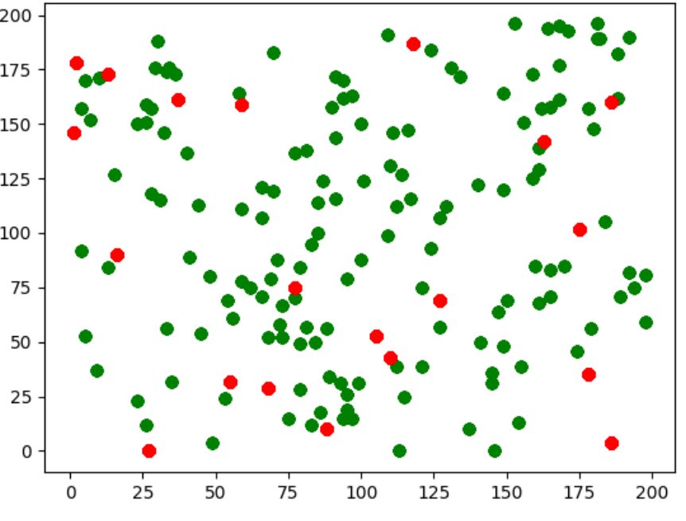

# Group Project 5 - Randomized Hotel Assignment
This project utilizes a randomization Manhattan-based algorithm in order to place 150 conference attendees within a 200 square block city into 20 hotels that
are randomly placed throughout the grid.

## Group Members

- Michelle Golden
- Shannon Mong

## Requirements

- Python v3.0+
- Pip (for python 3)
- NumPy
- Matplotlib

## Usage

Use the following command to run the program:

```
python main.py
```

## Hotel/Attendee Plot 

